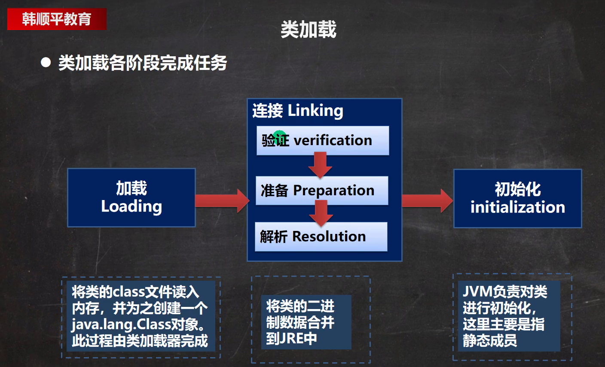
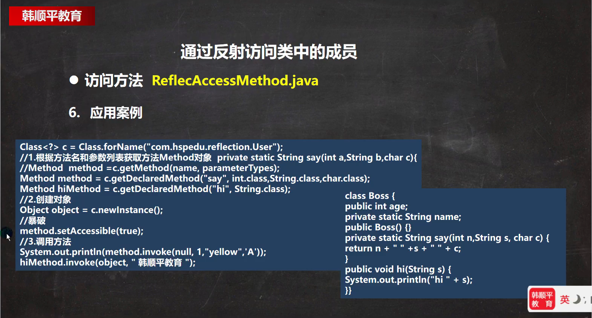
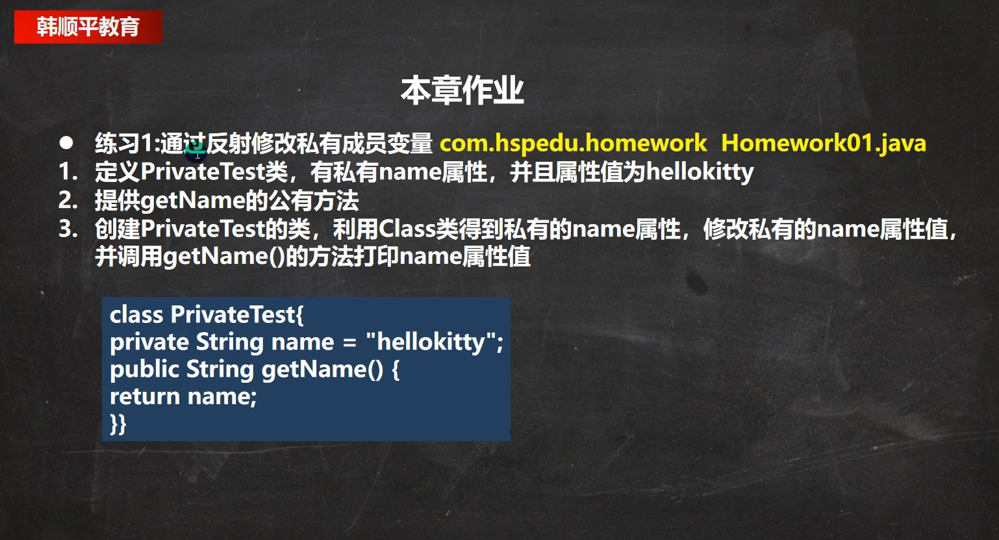
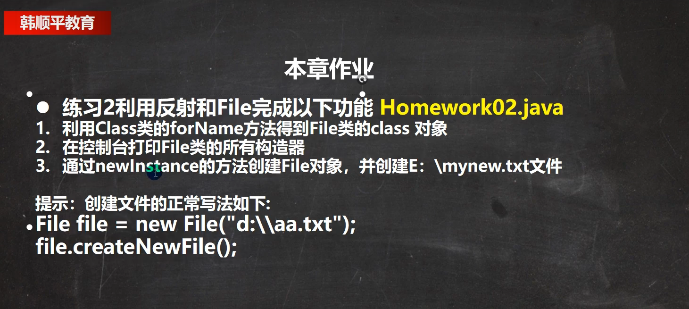

# 反射

反射是框架的基石，是实现动态创建的核心。

### 反射机制
- 反射相关的主要类：
1. java.lang.Class:代表一个类，Class对象表示某个类加载后在堆中的对象。
2. java.lang.reflect.Method:代表类的方法，Method对象。
3. java.lang.reflect.Field:代表类的成员变量。
4. java.lang.reflect.Constructor：代表类的构造方法。

这些类在java.lang.reflection。

### Class 类
参考 klass OOP 二分模型

    Class01.java com.reflection.class
1. Class也是类，因此继承了Object.
2. Class类对象不是new出来的，而是系统创建的。(ClassLoader.loadClass(name))
3. 每个类在内存中只有一份Class类对象，因为类只加载一次。
4. 每个类的实力都会记得自己是由哪个Class实例所生成。
5. 通过Class可以完整的得到一个类的完整结构。
6. Class对象是存放在堆的。
7. 类的字节码二进制数据是放在方法区的。有的地方成为类的元数据（包括 方法代码，变量名，方法名，访问权限等等。。）
   https://www.zhihu.com/question/38496907


常用方法：

| 方法名                                              | 功能                                                         |
| --------------------------------------------------- | ------------------------------------------------------------ |
| static Class forName(String name)                   | 返回指定类名name的Class对象。                                |
| Object newInstance()                                | 调用缺省构造函数，返回该Class对象的一个实例。                |
| getName()                                           | 返回此Class对象所表示的实体(类，接口，数组类，基本类型等)名称 |
| Class[] getInterfaces()                             | 获取当前Class对象的接口                                      |
| ClassLoader getClassLoader()                        | 返回该类的类加载器                                           |
| Class getSuperclass()                               | 返回表示此Class所表示的实体的超类的Class。                   |
| Constructor[] getConstructors()                     | 返回一个包含某些Constructor对象的数组。                      |
| Field[] getDeclaredFields()                         | 返回Field对象的一个数组。                                    |
| Method getMethod(String name, Class ... paramTypes) | 返回一个Method对下给你，此对象的形参类型为paramType          |


那些类型有Class对象。
1. 外部类，成员内部类，静态内部类，局部内部类，匿名内部类。
2. interface: 接口
3. 数组。
4. enum类
5. annotation：注解
6. 基本数据类型
7. void


### 类加载
ClassLoad_java com.hspedu.classload_
反射机制是java实现动态语言的关键，也就是通过反射实现类动态加载。
1. 静态加载：编译时加载相关的类，如果没有则报错，依赖性太强。
2. 动态加载：运行时加载需要的类，如果运行时不用该类，则不报错，降低了依赖性。

- 类加载时机
  - 1.创建对象时(new)
  - 2.当子类被加载时，弗雷也加载。
  - 3.调用类中的静态成员时。
  - 4.通过反射。



```markdown
### 加载阶段
JVM在该阶段的主要目的是将字节码从不同的数据源(可能是class文件、
也可能是jar包、甚至是网络)转化为二进制字节流加载到内存中，并生成一个代表该类的
jaca.lang.Class对象。

### 简介阶段-验证
1. 目的是为了确保Class文件的字节流中包含的信息符合当前虚拟机的要求，
并且不会危害虚拟机自身的安全。
2. 包括 ：文件格式验证(是否以魔数 oxcafebabe开头、源数据验证、字节码验证和符号引用验证)
3. 可以考虑使用 -Xverify:none 参数来关闭大部分的类验证措施，缩短虚拟机类加载的时间。

### 连接阶段-准别
2. JVM会在该阶段对静态变量，分配内存并默认初始化(对应数据类型的默认初始值，如0，0L,null,false等)。这些变量
   所使用的内存都将在方法区中进行分配。
  
3. 连接阶段-解析。
虚拟机将常量池内的符号引用替换为直接引用的过程。

   
   
### (Initialization)初始化
1. 到初始化阶段，才真正开始执行类中定义的java程序代码，此阶段是执行<clinit>()方法的过程。
2. <clinit>()方法是由编译器按语句在源文件中出现的顺序，依次自动收集类中的所有‘静态变量’的赋
   值动作和静态代码块中的语句，并进行合并。
3. 虚拟机会保证一个类的<clinit>()方法在多线程环境中被正确地加锁、同步，如果多个线程同时去初
   始化一个类，那么只会有一个线程去执行这个类的
   <clinit>()方法，其他线程都需要阻塞等待，直到活动线程执行<clinit>()方法完毕
```


### 反射获取类的结构信息
    com.reflection.ReflectionUtils
- 通过反射获取类的结构信息。
    - getName()：获取类的全名称。
    - getSimpleName()：获取类的名称；
    - getMethods()：获取本类及父类的public方法。
    - getDeprecatedMethods()：获取本类的所有方法。
    - getFields()：获取本类及父类所有public字段。
    - getDeprecatedFields();获取本类所有字段。
    - getConstructors();获取本类的public构造方法。
    - getDeprecatedConstructors();获取本类所有构造。
    - getInterfaces();获取所有接口。
    - getPackage();获取package对象。
    - getAnnotations();获取所有注解。
    - getSuperClass();获取父类Class对象。


```markdown
Class


### Field
java.lang.reflect.Field。
1. int getModifiers()获取修饰符信息（0.默认的、1.public、2.private、
   4.protected、8.static、16.final）如果多个修饰则相加。
2. getType()获取字段类型。
3. getName()获取字段名称。

### Method
1. int getModifiers()获取修饰符信息。(0.默认的、1.public、2.private、
   4.protected、8.static、16.find)
2. getReturnType()获取返回值类型。
3. getName()获取方法名。
4. Class[] getParameterType()获取方法参数类型。

### Constructor
1. getModifier(); 获取构造修饰符。
2. getName(); 获取构造名称。
3. getParameterType(); 获取构造器参数。

访问属性
反射无法修改被 final 修饰，及String 字符串。（待确认）

在设置属性值时，如果属性时static时，则可以直接传入reflecField.set(null,value);
因为static属性绑定的是class对象，非static绑定的是new的obj对象。


访问方法


```

### 反射相关类


### 反射调用性能优化


### Class常用方法


# 练习

1. 根据配置文件，re.properties 指定信息 创建对象并调用其方法


通过反射创建对象。

```markdown
1. 方式一：调用类中public修饰的无参构造器。
2. 方式二：调用类中指定构造器。

3. Class类相关方法
- newInstance; 调用类中无参构造器，获取对应类的对象。
- getConstruction(Class...class); 根据参数列表获取对应的构造器对象。
- getDeclaredConstruction(Class..class); 根据参数列表获取对应的构造器对象。

4. Constructor类相关方法。
- setAccessible 爆破，使用private构造器创建对象。
- newInstance(Object...obj):调用构造器。


```




